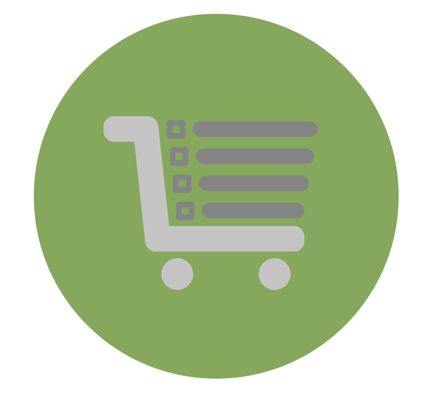
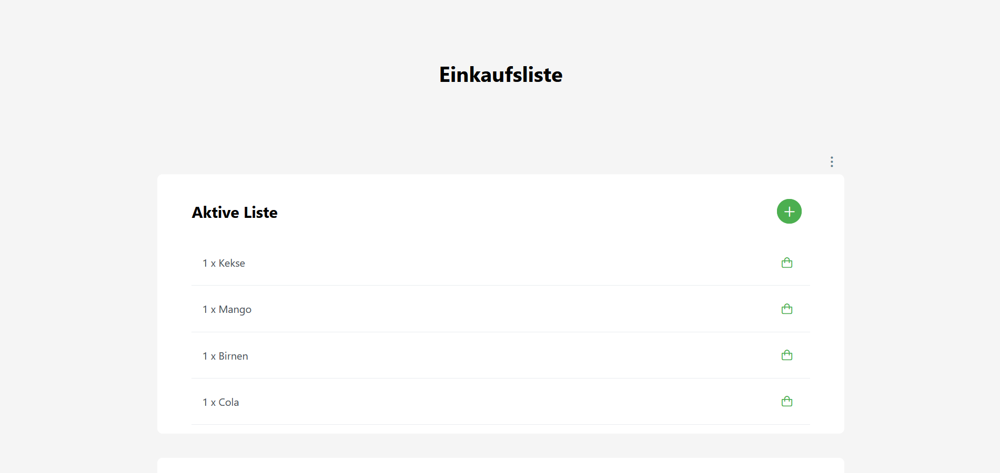

<h1 align="center">Shopping list </h1>

  
   
  <em>A modern selfhosted shopping list with useful
        features like live updates, product suggestions and more.</em>
   

---

# About

This web client serves as the front end for my favorite project, a comprehensive shopping list application. The entire development, from concept to implementation, has been undertaken by myself.

## Key Features:

### Privacy Focus:

The application is currently built to be self-hosted, emphasizing a privacy-focused approach to ensure that your data remains secure and under your control.

### Dark Mode:

Enjoy a visually appealing experience with the option to switch between light and dark modes. The dark mode enhances readability and reduces eye strain during low-light conditions.

### Always Reachable:

Access your shopping list anytime, anywhere. The web client ensures that your shopping list is always reachable, providing seamless access whether you're at home, on the go, or in-store.

### Amazing Caching:

Experience unparalleled performance with advanced caching mechanisms. Even in scenarios where there is intermittent or no connection to the server, the application leverages powerful caching to ensure a smooth and responsive user experience.

### Unrevealed Features:

While the complete set of features remains undisclosed until the official release, anticipate a range of innovative functionalities designed to streamline your shopping experience. From intelligent sorting algorithms to intuitive user interactions, the project aims to redefine the way you manage your shopping list.

## Project Status:

The project is essentially finished; however, I am currently evaluating how and if I will market it. The decision will be influenced by the level of interest generated by this project. Let me know about your thoughts by submitting an issue

Stay tuned for updates as the project progresses, and your interest will play a crucial role in shaping the future of this exciting shopping list application!

### Technology

This project uses some Frameworks:

#### General used Tech

| Tech                                                                                                                                        | Description                                          |
| ------------------------------------------------------------------------------------------------------------------------------------------- | ---------------------------------------------------- |
|      | Docker for fast and reproducible deployments         |
|  | For code hosting                                     |
| [REST](https://www.ibm.com/cloud/learn/rest-apis)                                                                                           | The whole API is designed around the REST principles |
| [SignalR](https://dotnet.microsoft.com/en-us/apps/aspnet/signalr)                                                                           | Websockets for real-time data transfers              |

#### Front-End

| Tech                                                                                                                                                        | Description                                     |
| ----------------------------------------------------------------------------------------------------------------------------------------------------------- | ----------------------------------------------- |
|   | Framework for Front-End Single Page Application |
|  | JavaScript with syntax for types                |
